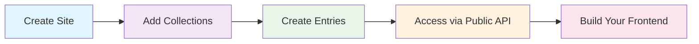

# BareCMS Documentation

<div align="center">


**Complete developer documentation for BareCMS**

_A lightweight, open-source headless CMS designed with bare minimalism in mind_

[](https://github.com/snowztech/barecms)
[](https://github.com/snowztech/barecms/blob/main/LICENSE)
[](https://github.com/snowztech/barecms/pkgs/container/barecms)

[🚀 **Get Started**](getting-started/README.md) • [🔌 **API Reference**](api/README.md) • [🐳 **Deploy**](deployment/README.md) • [💻 **Integrate**](integration/frontend-examples.md)

</div>

---

## 🎯 What is BareCMS?

BareCMS is a **headless CMS** that prioritizes simplicity and minimalism. Unlike traditional CMSs, BareCMS provides:

- **🎯 Pure API-first approach** - Content management through REST API
- **⚡ Lightweight architecture** - Built with Go and React for performance
- **🔧 Headless by design** - Use any frontend framework you prefer
- **🐳 Easy deployment** - Docker-ready with simple configuration
- **🔐 Secure authentication** - JWT-based authentication system

---

## 🚀 Quick Example

### 1. Create Content Structure

```bash
# Create a site
POST /api/sites
{
  "name": "My Blog",
  "slug": "my-blog"
}

# Create a collection
POST /api/sites/1/collections
{
  "name": "Posts",
  "slug": "posts"
}

# Create an entry
POST /api/collections/1/entries
{
  "title": "Hello World",
  "content": "My first post!",
  "slug": "hello-world"
}
```

### 2. Access Data Publicly

```bash
# Get all site data (no authentication needed)
GET /my-blog/data

# Response
{
  "site": { "name": "My Blog", "slug": "my-blog" },
  "collections": [
    {
      "name": "Posts",
      "entries": [
        {
          "title": "Hello World",
          "content": "My first post!",
          "slug": "hello-world"
        }
      ]
    }
  ]
}
```

### 3. Use in Your Frontend

```javascript
// Fetch data in your React/Vue/Next.js app
const response = await fetch("https://your-barecms.com/my-blog/data");
const { site, collections } = await response.json();

// Render your content
collections[0].entries.forEach((post) => {
  console.log(post.title, post.content);
});
```

🎉 **That's it!** You now have a working headless CMS with public API access.

---

## 📚 Documentation Sections

<div class="grid" style="display: grid; grid-template-columns: repeat(auto-fit, minmax(250px, 1fr)); gap: 1.5rem; margin: 2rem 0;">

<div style="padding: 1.5rem; border: 1px solid #e1e5e9; border-radius: 8px; background: #f8f9fa;">

### 🏁 **Getting Started**

Perfect for beginners. Get BareCMS running in 5 minutes.

- [Installation](getting-started/installation.md)
- [Quick Start Tutorial](getting-started/quick-start.md)
- [Your First Site](getting-started/first-site.md)

</div>

<div style="padding: 1.5rem; border: 1px solid #e1e5e9; border-radius: 8px; background: #f8f9fa;">

### 🔌 **API Reference**

Complete API documentation with examples.

- [Authentication](api/authentication.md)
- [Sites, Collections & Entries](api/README.md)
- [Public Data API](api/public-data.md)

</div>

<div style="padding: 1.5rem; border: 1px solid #e1e5e9; border-radius: 8px; background: #f8f9fa;">

### 🔗 **Integration Examples**

Real-world examples for popular frameworks.

- [React & Vue.js](integration/frontend-examples.md)
- [Next.js & Gatsby](integration/static-site-generators.md)
- [Mobile Apps](integration/mobile-apps.md)

</div>

<div style="padding: 1.5rem; border: 1px solid #e1e5e9; border-radius: 8px; background: #f8f9fa;">

### 🐳 **Deployment**

Production-ready deployment guides.

- [Docker Compose](deployment/docker-compose.md)
- [Self-Hosting](deployment/self-hosting.md)
- [HTTPS Setup](deployment/https.md)

</div>

</div>

---

## 🔧 Core Workflow



1. **Create a Site** - Your content container
2. **Add Collections** - Group related content (Posts, Pages, Products)
3. **Create Entries** - Add your actual content
4. **Access via Public API** - Fetch data for your frontend
5. **Build Your Frontend** - Use any framework you like

---

## 🌟 Why Choose BareCMS?

| Feature                  | BareCMS         | Traditional CMS       |
| ------------------------ | --------------- | --------------------- |
| **Setup Time**           | 5 minutes       | Hours/Days            |
| **Learning Curve**       | Minimal         | Steep                 |
| **Performance**          | Lightning fast  | Often slow            |
| **Flexibility**          | Any frontend    | Locked themes         |
| **Developer Experience** | API-first       | Template-based        |
| **Hosting**              | Docker anywhere | Specific requirements |

---

## 🆘 Need Help?

<div style="display: grid; grid-template-columns: repeat(auto-fit, minmax(200px, 1fr)); gap: 1rem; margin: 1.5rem 0;">

<div style="text-align: center; padding: 1rem;">

**🐛 Found a Bug?**

[Report on GitHub Issues](https://github.com/snowztech/barecms/issues)

</div>

<div style="text-align: center; padding: 1rem;">

**💬 Have Questions?**

[Ask in Discussions](https://github.com/snowztech/barecms/discussions)

</div>

<div style="text-align: center; padding: 1rem;">

**📖 Missing Docs?**

[Edit this page](https://github.com/snowztech/barecms-docs/edit/main/README.md)

</div>

<div style="text-align: center; padding: 1rem;">

**❤️ Love BareCMS?**

[Sponsor the Project](https://github.com/sponsors/lucasnevespereira)

</div>

</div>

---

**Ready to build something amazing with BareCMS?** [**Let's get started! →**](getting-started/README.md)

<div style="text-align: center; margin: 2rem 0; color: #666; font-size: 0.9em;">
Built with ❤️ by <a href="https://github.com/snowztech" target="_blank">SnowzTech</a> • Keep it simple
</div>
