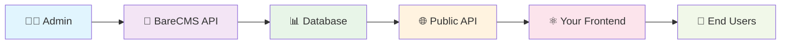

# BareCMS Documentation

<div align="center">


**Complete developer documentation for BareCMS**

_A lightweight, open-source headless CMS designed with bare minimalism in mind_

[](https://github.com/snowztech/barecms)
[](https://github.com/snowztech/barecms/blob/main/LICENSE)
[](https://github.com/snowztech/barecms/pkgs/container/barecms)

[🚀 **Get Started**](getting-started/README.md) • [🔌 **API Reference**](api/README.md) • [🐳 **Deploy**](deployment/self-hosting.md) • [💻 **Integrate**](integration/frontend-examples.md)

</div>

---

## 🎯 What is BareCMS?

BareCMS is a **headless CMS** that prioritizes simplicity and minimalism. Perfect for developers who want:

- **🎯 Pure API-first approach** - Content management through clean REST API
- **⚡ Lightning fast** - Built with Go and React for maximum performance
- **🔧 Framework agnostic** - Use with React, Vue, Next.js, or any frontend
- **🐳 Docker ready** - Deploy anywhere in minutes
- **🔐 Secure by default** - JWT authentication and secure practices

---

## 🚀 Quick Start Example

### 1. Deploy BareCMS

```bash
# Clone and start in 30 seconds
git clone https://github.com/snowztech/barecms.git
cd barecms
cp .env.example .env
# Edit JWT_SECRET in .env
make up
```

### 2. Create Content

```bash
# Create a site
POST /api/sites
{
  "name": "My Blog",
  "slug": "my-blog"
}

# Add a collection
POST /api/sites/1/collections
{
  "name": "Posts",
  "slug": "posts"
}

# Add content
POST /api/collections/1/entries
{
  "title": "Hello World",
  "content": "My first post with BareCMS!",
  "slug": "hello-world"
}
```

### 3. Access Data Publicly

```bash
# Get all site data (no auth needed!)
curl https://your-barecms.com/my-blog/data

{
  "site": { "name": "My Blog", "slug": "my-blog" },
  "collections": [
    {
      "name": "Posts",
      "entries": [
        {
          "title": "Hello World",
          "content": "My first post with BareCMS!",
          "slug": "hello-world"
        }
      ]
    }
  ]
}
```

### 4. Use in Your Frontend

```javascript
// Works with any framework!
const response = await fetch("https://your-barecms.com/my-blog/data");
const { site, collections } = await response.json();

// Render your content
collections[0].entries.forEach((post) => {
  console.log(post.title, post.content);
});
```

🎉 **That's it!** You now have a working headless CMS.

---

## 📚 Documentation Sections

<div style="display: grid; grid-template-columns: repeat(auto-fit, minmax(280px, 1fr)); gap: 1.5rem; margin: 2rem 0;">

<div style="padding: 1.5rem; border: 1px solid #e1e5e9; border-radius: 8px; background: #f8f9fa;">

### 🏁 **Getting Started**

New to BareCMS? Start here!

- [**Installation →**](getting-started/installation.md) - Get running in 5 minutes
- [**Quick Start →**](getting-started/quick-start.md) - Complete tutorial
- [**First Site →**](getting-started/first-site.md) - Build your first project

</div>

<div style="padding: 1.5rem; border: 1px solid #e1e5e9; border-radius: 8px; background: #f8f9fa;">

### 🔌 **API Reference**

Complete API documentation with examples

- [**API Overview →**](api/README.md) - All endpoints
- [**Public Data API →**](api/public-data.md) - Key endpoint
- [**Authentication →**](api/authentication.md) - JWT setup

</div>

<div style="padding: 1.5rem; border: 1px solid #e1e5e9; border-radius: 8px; background: #f8f9fa;">

### 🔗 **Integration**

Real examples for popular frameworks

- [**React & Vue.js →**](integration/frontend-examples.md) - Components and hooks
- [**Next.js & Gatsby →**](integration/static-site-generators.md) - Static site generation
- [**Mobile Apps →**](integration/mobile-apps.md) - React Native, Flutter

</div>

<div style="padding: 1.5rem; border: 1px solid #e1e5e9; border-radius: 8px; background: #f8f9fa;">

### 🐳 **Deployment**

Production-ready hosting guides

- [**Self-Hosting →**](deployment/self-hosting.md) - Own your infrastructure
- [**Docker Compose →**](deployment/docker-compose.md) - Easy setup
- [**HTTPS Setup →**](deployment/https.md) - Secure your site

</div>

</div>

---

## 🔧 How BareCMS Works



1. **Admin creates content** via authenticated API
2. **BareCMS stores** in PostgreSQL database
3. **Public API serves** content without authentication
4. **Your frontend consumes** data via simple HTTP calls
5. **End users see** your beautiful application

---

## 🌟 Why Choose BareCMS?

| ✅ BareCMS                 | ❌ Traditional CMS           |
| -------------------------- | ---------------------------- |
| **5-minute setup**         | Hours of configuration       |
| **Any frontend framework** | Locked to specific themes    |
| **API-first design**       | Template-dependent           |
| **Docker deployment**      | Complex hosting requirements |
| **Minimal learning curve** | Steep learning curve         |
| **Production ready**       | Often needs plugins          |

---

## 🎯 Common Use Cases

<div style="display: grid; grid-template-columns: repeat(auto-fit, minmax(250px, 1fr)); gap: 1rem; margin: 1.5rem 0;">

<div style="text-align: center; padding: 1.5rem; border: 1px solid #ddd; border-radius: 8px;">

**📝 Blog & Content Sites**

[See Example →](guides/use-cases.md#blog-sites)

</div>

<div style="text-align: center; padding: 1.5rem; border: 1px solid #ddd; border-radius: 8px;">

**🛒 E-commerce Backends**

[See Example →](guides/use-cases.md#ecommerce)

</div>

<div style="text-align: center; padding: 1.5rem; border: 1px solid #ddd; border-radius: 8px;">

**📱 Mobile App APIs**

[See Example →](guides/use-cases.md#mobile-apps)

</div>

<div style="text-align: center; padding: 1.5rem; border: 1px solid #ddd; border-radius: 8px;">

**💼 Portfolio Sites**

[See Example →](guides/use-cases.md#portfolios)

</div>

</div>

---

## 🆘 Need Help?

<div style="display: grid; grid-template-columns: repeat(auto-fit, minmax(220px, 1fr)); gap: 1rem; margin: 2rem 0;">

<div style="text-align: center; padding: 1.5rem;">

**🐛 Found a Bug?**

[Report on GitHub Issues](https://github.com/snowztech/barecms/issues)

</div>

<div style="text-align: center; padding: 1.5rem;">

**💬 Have Questions?**

[Ask in Discussions](https://github.com/snowztech/barecms/discussions)

</div>

<div style="text-align: center; padding: 1.5rem;">

**📚 Improve Docs?**

[Edit on GitHub](https://github.com/snowztech/barecms-docs)

</div>

<div style="text-align: center; padding: 1.5rem;">

**❤️ Love BareCMS?**

[Sponsor the Project](https://github.com/sponsors/lucasnevespereira)

</div>

</div>

---

**Ready to build something amazing?** [**🚀 Get started now →**](getting-started/README.md)

<div style="text-align: center; margin: 2rem 0; padding: 1rem; background: #f8f9fa; border-radius: 8px;">
<strong>BareCMS</strong> • Built with ❤️ by <a href="https://github.com/snowztech" target="_blank">SnowzTech</a> • Keep it simple
</div>
