<div align="center">



<h1>BareCMS</h1>

<h3><em>A lightweight, open-source headless CMS designed with bare minimalism in mind</em></h3>


<a href="LICENSE">
  
</a>

<a href="https://github.com/sponsors/lucasnevespereira">
  
</a>

</div>

---

## What is BareCMS?

BareCMS is a lightweight headless CMS built with Go and React, designed for developers who want simplicity without sacrificing functionality.

### Core Features

- **🎯 Minimalist Design**: Clean, intuitive interface focused on content management
- **⚡ Fast & Lightweight**: Built with performance in mind using Go and React
- **🔧 Headless Architecture**: Use any frontend framework or static site generator
- **🐳 Docker Ready**: Easy deployment with Docker and Docker Compose
- **🔐 Secure Authentication**: JWT-based authentication system
- **🌐 Public API**: Access your content without authentication

### How it Works

BareCMS provides a simple API-first content management system with:

- **Sites** - Content containers for your projects
- **Collections** - Groups of related content (e.g., "Posts", "Pages")
- **Entries** - Individual pieces of content within collections
- **Public API** - Access your content without authentication

---

## Quick Start

### 🚀 Local Development

Get up and running in minutes:

```bash
# Clone the repository
git clone https://github.com/snowztech/barecms.git
cd barecms

# Set up environment
cp .env.example .env

# Start development environment
make up
```

Access your local BareCMS instance at `http://localhost:8080`

### 🐳 Production Deployment

Deploy to your own server:

```bash
# On your server
git clone https://github.com/snowztech/barecms.git
cd barecms

# Configure environment
cp .env.example .env
# Edit .env with your production settings

# Deploy
docker compose up -d
```

---

## Public Data Access

The key endpoint for headless usage:

```http
GET /:siteSlug/data
```

This returns all content for a site without requiring authentication, making it perfect for frontend applications.

**Example usage:**

```javascript
// Fetch public site data
const response = await fetch("https://your-cms.com/my-site/data");
const siteData = await response.json();

// Access collections and entries
const posts = siteData.collections.posts;
const pages = siteData.collections.pages;
```

---

## Next Steps

- [**🚀 Getting Started**](getting-started.md) - Set up BareCMS locally
- [**🔌 API Reference**](api.md) - Complete API documentation
- [**🐳 Self-Hosting**](self-hosting.md) - Deploy to production
- [**⚙️ Development**](development.md) - Contributing to BareCMS

---

## Community & Support

- **🐛 Found a bug?** [Report it here](https://github.com/snowztech/barecms/issues)
- **💡 Have an idea?** [Start a discussion](https://github.com/snowztech/barecms/discussions)
- **❤️ Love BareCMS?** [Sponsor the project](https://github.com/sponsors/lucasnevespereira)

---

<div align="center">

**Built with ❤️ by [SnowzTech](https://github.com/snowztech)**

_Simple, lightweight, and built for developers._

</div>
