# BareCMS

> A lightweight, open-source headless CMS designed with bare minimalism in mind

- **🎯 Minimalist Design**: Clean, intuitive interface focused on content management
- **⚡ Fast & Lightweight**: Built with performance in mind using Go and React
- **🔧 Headless Architecture**: Use any frontend framework or static site generator
- **🐳 Docker Ready**: Easy deployment with Docker and Docker Compose

[GitHub](https://github.com/snowztech/barecms)
[Get Started](#welcome-to-barecms)

