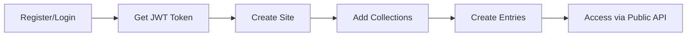

# BareCMS API Reference

Complete API documentation for BareCMS - your headless CMS built for developers.

## 📋 Overview

BareCMS provides a clean RESTful API for content management and public data access. The API is designed with simplicity and power in mind.

### Key Features

- **🌐 Public Data API** - Access content without authentication
- **🔐 JWT Authentication** - Secure content management
- **📊 RESTful Design** - Predictable endpoints and responses
- **⚡ Fast Performance** - Optimized for speed
- **🔄 Real-time Updates** - Changes reflect immediately

---

## 🚀 Quick Start

### Base URL

```
http://localhost:8080
```

### Authentication

Include the JWT token in the Authorization header for authenticated endpoints:

```
Authorization: Bearer <your-jwt-token>
```

### Core Workflow



---

## 🌐 Public Data Access (Key Endpoint)

### Get All Site Data

**The most important endpoint** - get all your site's content publicly.

**`GET /:siteSlug/data`**

```bash
curl http://localhost:8080/my-blog/data
```

**Response:**

```json
{
  "site": {
    "id": 1,
    "name": "My Blog",
    "slug": "my-blog",
    "description": "A simple blog built with BareCMS"
  },
  "collections": [
    {
      "id": 1,
      "name": "Posts",
      "slug": "posts",
      "description": "Blog posts collection",
      "entries": [
        {
          "id": 1,
          "title": "Welcome to BareCMS",
          "content": "This is my first blog post...",
          "slug": "welcome-to-barecms",
          "created_at": "2024-01-15T10:30:00Z"
        }
      ]
    }
  ]
}
```

💡 **This endpoint powers your entire frontend** - no authentication required!

---

## 📚 API Sections

### [Authentication](authentication.md)

- **Register/Login** - User account management
- **JWT Tokens** - Secure API access
- **Password Reset** - Account recovery

### [Sites API](sites.md)

- **Create Sites** - Content containers
- **Manage Sites** - Update and delete
- **List Sites** - Get all your sites

### [Collections API](collections.md)

- **Create Collections** - Group related content
- **Manage Collections** - Update structure
- **Organize Content** - Logical grouping

### [Entries API](entries.md)

- **Create Entries** - Add content
- **Update Entries** - Modify content
- **Delete Entries** - Remove content

### [Public Data API](public-data.md)

- **Public Access** - Frontend integration
- **Performance** - Caching strategies
- **Usage Examples** - Real implementations

### [Error Handling](errors.md)

- **HTTP Status Codes** - Response meanings
- **Error Formats** - Consistent responses
- **Troubleshooting** - Common issues

---

## 🔧 API Overview

### Complete Endpoint List

#### **Authentication**

```bash
POST /api/auth/register    # Register new user
POST /api/auth/login       # Login user
POST /api/auth/refresh     # Refresh token
GET  /api/auth/profile     # Get user profile
PUT  /api/auth/profile     # Update profile
```

#### **Sites Management**

```bash
GET    /api/sites          # List all sites
POST   /api/sites          # Create new site
GET    /api/sites/:id      # Get site details
PUT    /api/sites/:id      # Update site
DELETE /api/sites/:id      # Delete site
```

#### **Collections Management**

```bash
GET    /api/sites/:siteId/collections     # List collections
POST   /api/sites/:siteId/collections     # Create collection
GET    /api/collections/:id               # Get collection
PUT    /api/collections/:id               # Update collection
DELETE /api/collections/:id               # Delete collection
```

#### **Entries Management**

```bash
GET    /api/collections/:collectionId/entries  # List entries
POST   /api/collections/:collectionId/entries  # Create entry
GET    /api/entries/:id                         # Get entry
PUT    /api/entries/:id                         # Update entry
DELETE /api/entries/:id                         # Delete entry
```

#### **Public Access**

```bash
GET /:siteSlug/data        # Get all site data (PUBLIC)
GET /api/health            # Health check
```

---

## 📝 Request/Response Format

### Request Headers

```bash
Content-Type: application/json
Authorization: Bearer <jwt-token>  # For authenticated endpoints
```

### Response Format

**Success Response:**

```json
{
  "id": 1,
  "name": "Resource name",
  "created_at": "2024-01-15T10:30:00Z",
  "updated_at": "2024-01-15T10:30:00Z"
}
```

**Error Response:**

```json
{
  "error": "Resource not found",
  "code": "NOT_FOUND",
  "message": "The requested resource could not be found",
  "details": {
    "resource": "site",
    "id": 123
  }
}
```

---

## 🎯 Common Patterns

### Creating a Complete Site

```bash
# 1. Register/Login
curl -X POST http://localhost:8080/api/auth/register \
  -d '{"email":"user@example.com","password":"password"}'

# 2. Create Site
curl -X POST http://localhost:8080/api/sites \
  -H "Authorization: Bearer TOKEN" \
  -d '{"name":"My Blog","slug":"my-blog"}'

# 3. Add Collection
curl -X POST http://localhost:8080/api/sites/1/collections \
  -H "Authorization: Bearer TOKEN" \
  -d '{"name":"Posts","slug":"posts"}'

# 4. Create Entry
curl -X POST http://localhost:8080/api/collections/1/entries \
  -H "Authorization: Bearer TOKEN" \
  -d '{"title":"Hello World","content":"My first post"}'

# 5. Access Publicly
curl http://localhost:8080/my-blog/data
```

### Frontend Integration

```javascript
// Fetch all site data
const response = await fetch("http://localhost:8080/my-blog/data");
const { site, collections } = await response.json();

// Get specific collection
const posts = collections.find((c) => c.slug === "posts");

// Render content
posts.entries.forEach((post) => {
  console.log(post.title, post.content);
});
```

---

## ⚡ Performance & Caching

### Response Times

- **Public Data API**: ~50ms average
- **Authenticated endpoints**: ~100ms average
- **Database operations**: Optimized with indexes

### Caching Strategy

- **Public data**: Cached for 1 hour
- **Static content**: Browser cache recommended
- **API responses**: ETag support for conditional requests

### Rate Limiting

- **Authenticated users**: 1000 requests/hour
- **Public endpoints**: 100 requests/minute per IP
- **Burst allowance**: 10 requests/second

---

## 🔐 Security

### Authentication

- **JWT tokens** with secure expiration
- **bcrypt** password hashing
- **Rate limiting** on all endpoints

### Authorization

- **User-based access** to sites and content
- **Public endpoints** are read-only
- **CORS** configured for your domains

### Best Practices

- Store tokens securely (not in localStorage)
- Use HTTPS in production
- Implement proper CORS headers
- Monitor for unusual activity

---

## 🧪 Testing & Development

### API Testing Tools

**Using curl:**

```bash
# Set base URL and token
BASE_URL="http://localhost:8080"
TOKEN="your-jwt-token"

# Test authenticated endpoint
curl -H "Authorization: Bearer $TOKEN" $BASE_URL/api/sites
```

**Using Postman:**

- Import the BareCMS collection
- Set environment variables for base URL and token
- Test all endpoints interactively

**Using JavaScript:**

```javascript
// API client helper
class BareCMSClient {
  constructor(baseURL, token = null) {
    this.baseURL = baseURL;
    this.token = token;
  }

  async request(endpoint, options = {}) {
    const url = `${this.baseURL}${endpoint}`;
    const headers = {
      "Content-Type": "application/json",
      ...(this.token && { Authorization: `Bearer ${this.token}` }),
      ...options.headers,
    };

    const response = await fetch(url, { ...options, headers });
    return response.json();
  }

  async getSiteData(slug) {
    return this.request(`/${slug}/data`);
  }
}
```

---

## 🆘 Need Help?

### Quick Links

- **[Authentication Guide →](authentication.md)** - Get started with tokens
- **[Public Data API →](public-data.md)** - Frontend integration
- **[Error Reference →](errors.md)** - Troubleshoot issues
- **[Frontend Examples →](../integration/frontend-examples.md)** - Real implementations

### Support

- **GitHub Issues**: [Report bugs](https://github.com/snowztech/barecms/issues)
- **Discussions**: [Ask questions](https://github.com/snowztech/barecms/discussions)
- **Documentation**: [Improve docs](https://github.com/snowztech/barecms-docs)

---

**Ready to integrate BareCMS into your project?** [**🚀 See integration examples →**](../integration/frontend-examples.md)

---

_The API is your gateway to headless content management. Build anything! 🎯_
