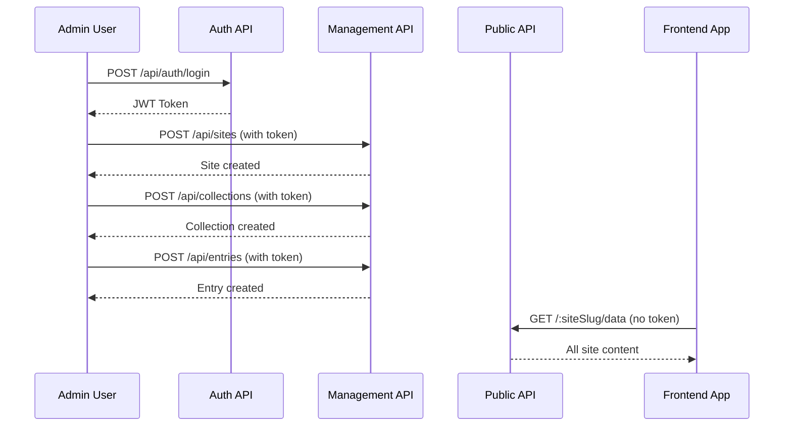

# BareCMS API Reference

Complete reference for the BareCMS REST API. Build powerful headless applications with confidence.

## 🚀 Quick Overview

BareCMS provides a clean, RESTful API with two main access patterns:

- **🔐 Authenticated API** - Content management (create, update, delete)
- **🌐 Public API** - Content consumption (read-only, no authentication)

### Base URL

```
https://your-barecms-instance.com
```

### Authentication

All management endpoints require JWT authentication:

```bash
Authorization: Bearer <your-jwt-token>
```

---

## 📚 API Sections

<table>
<tr>
<td width="50%">

### 🔐 **Management API**

_Requires Authentication_

- **[Authentication](authentication.md)** - Login, register, tokens
- **[Sites API](sites.md)** - Manage sites
- **[Collections API](collections.md)** - Manage collections
- **[Entries API](entries.md)** - Manage entries

</td>
<td width="50%">

### 🌐 **Public API**

_No Authentication Required_

- **[Public Data API](public-data.md)** - Access all site content
- **[Error Handling](errors.md)** - Error codes and responses

</td>
</tr>
</table>

---

## 🌟 Key Endpoint

### Public Data Access

```http
GET /:siteSlug/data
```

**This is the most important endpoint** - it provides all your site's content publicly for frontend consumption.

**Example:**

```bash
curl https://your-barecms.com/my-blog/data
```

**Response:**

```json
{
  "site": {
    "id": 1,
    "name": "My Blog",
    "slug": "my-blog",
    "description": "A simple blog"
  },
  "collections": [
    {
      "id": 1,
      "name": "Posts",
      "slug": "posts",
      "description": "Blog posts",
      "entries": [
        {
          "id": 1,
          "title": "Welcome to BareCMS",
          "content": "This is my first post...",
          "slug": "welcome-to-barecms",
          "created_at": "2024-01-15T10:30:00Z",
          "updated_at": "2024-01-15T10:30:00Z"
        }
      ]
    }
  ]
}
```

---

## 🔄 API Workflow



1. **Admin authenticates** and gets JWT token
2. **Admin creates content** using management API with token
3. **Frontend consumes content** using public API without token

---

## 📖 Quick Reference

### Authentication Endpoints

```bash
POST /api/auth/register    # Register new user
POST /api/auth/login       # Login user
POST /api/auth/logout      # Logout user
```

### Sites Management

```bash
GET    /api/sites          # List all sites
POST   /api/sites          # Create site
GET    /api/sites/:id      # Get site details
PUT    /api/sites/:id      # Update site
DELETE /api/sites/:id      # Delete site
```

### Collections Management

```bash
GET    /api/sites/:siteId/collections    # List site collections
POST   /api/sites/:siteId/collections    # Create collection
GET    /api/collections/:id              # Get collection details
PUT    /api/collections/:id              # Update collection
DELETE /api/collections/:id              # Delete collection
```

### Entries Management

```bash
GET    /api/collections/:collectionId/entries    # List collection entries
POST   /api/collections/:collectionId/entries    # Create entry
GET    /api/entries/:id                          # Get entry details
PUT    /api/entries/:id                          # Update entry
DELETE /api/entries/:id                          # Delete entry
```

### Public Data Access

```bash
GET /:siteSlug/data        # Get all site data publicly
```

---

## 🎯 Common Use Cases

### Blog Site

```bash
# 1. Create blog site
POST /api/sites {"name": "My Blog", "slug": "blog"}

# 2. Add posts collection
POST /api/sites/1/collections {"name": "Posts", "slug": "posts"}

# 3. Add blog post
POST /api/collections/1/entries {
  "title": "Hello World",
  "content": "My first post",
  "slug": "hello-world"
}

# 4. Access from frontend
GET /blog/data
```

### E-commerce Site

```bash
# 1. Create store site
POST /api/sites {"name": "My Store", "slug": "store"}

# 2. Add products collection
POST /api/sites/1/collections {"name": "Products", "slug": "products"}

# 3. Add pages collection
POST /api/sites/1/collections {"name": "Pages", "slug": "pages"}

# 4. Access from frontend
GET /store/data
```

### Portfolio Site

```bash
# 1. Create portfolio site
POST /api/sites {"name": "Portfolio", "slug": "portfolio"}

# 2. Add projects collection
POST /api/sites/1/collections {"name": "Projects", "slug": "projects"}

# 3. Add testimonials collection
POST /api/sites/1/collections {"name": "Testimonials", "slug": "testimonials"}

# 4. Access from frontend
GET /portfolio/data
```

---

## ⚡ Best Practices

### 1. Use Descriptive Slugs

```bash
# Good
{"slug": "about-us"}
{"slug": "contact-page"}
{"slug": "product-launch-2024"}

# Avoid
{"slug": "page1"}
{"slug": "item"}
{"slug": "content"}
```

### 2. Organize with Collections

```bash
# Blog structure
- Posts collection
- Pages collection
- Authors collection

# E-commerce structure
- Products collection
- Categories collection
- Orders collection
```

### 3. Plan Your Content Structure

```bash
# Think about your frontend needs
GET /my-site/data
# Should return everything your frontend needs
```

### 4. Handle Errors Gracefully

```javascript
try {
  const response = await fetch("/my-site/data");
  if (!response.ok) {
    throw new Error("Failed to fetch data");
  }
  const data = await response.json();
  // Use data...
} catch (error) {
  console.error("Error:", error);
  // Handle error...
}
```

---

## 🔍 Need More Details?

- **[Authentication Guide →](authentication.md)** - JWT tokens, login/logout
- **[Sites API →](sites.md)** - Complete sites endpoint reference
- **[Collections API →](collections.md)** - Complete collections endpoint reference
- **[Entries API →](entries.md)** - Complete entries endpoint reference
- **[Public Data API →](public-data.md)** - Public consumption patterns
- **[Error Handling →](errors.md)** - Error codes and troubleshooting

---

## 🆘 Getting Help

- **API not working?** Check [Error Handling](errors.md)
- **Need examples?** See [Integration Examples](../integration/frontend-examples.md)
- **Questions?** Ask in [GitHub Discussions](https://github.com/snowztech/barecms/discussions)

---

_Build amazing headless applications with BareCMS! 🚀_
