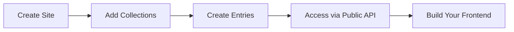

# Getting Started with BareCMS

Welcome to BareCMS! This guide will help you get up and running quickly with your first headless CMS setup.

## 📋 What You'll Learn

- [Installation](#-installation) - Get BareCMS running locally
- [Quick Start](#-quick-start) - Create your first site in 5 minutes
- [First Site](#-first-site) - Build a complete example
- [Configuration](#-configuration) - Customize your setup

---

## 🚀 Installation

### Prerequisites

- **Docker & Docker Compose** - [Install Docker](https://docs.docker.com/get-docker/)
- **Basic terminal knowledge**
- **5 minutes of your time**

### Quick Installation

```bash
# Clone the repository
git clone https://github.com/snowztech/barecms.git
cd barecms

# Set up environment
cp .env.example .env

# Generate a secure JWT secret
openssl rand -base64 32
# Copy this to your .env file as JWT_SECRET

# Start BareCMS
make up
```

### Access Your CMS

- **Admin Interface**: [http://localhost:8080](http://localhost:8080)
- **API Base URL**: `http://localhost:8080/api`

---

## ⚡ Quick Start

### 1. Create Your Account

Navigate to [http://localhost:8080](http://localhost:8080) and register your first admin account.

### 2. Create Your First Site

```bash
curl -X POST http://localhost:8080/api/sites \
  -H "Authorization: Bearer YOUR_JWT_TOKEN" \
  -H "Content-Type: application/json" \
  -d '{
    "name": "My Blog",
    "slug": "my-blog",
    "description": "My awesome blog"
  }'
```

### 3. Add a Collection

```bash
curl -X POST http://localhost:8080/api/sites/1/collections \
  -H "Authorization: Bearer YOUR_JWT_TOKEN" \
  -H "Content-Type: application/json" \
  -d '{
    "name": "Posts",
    "slug": "posts",
    "description": "Blog posts"
  }'
```

### 4. Create Your First Entry

```bash
curl -X POST http://localhost:8080/api/collections/1/entries \
  -H "Authorization: Bearer YOUR_JWT_TOKEN" \
  -H "Content-Type: application/json" \
  -d '{
    "title": "Welcome to BareCMS",
    "content": "This is my first blog post using BareCMS!",
    "slug": "welcome-to-barecms"
  }'
```

### 5. Access Your Data Publicly

```bash
# No authentication needed!
curl http://localhost:8080/my-blog/data
```

**Response:**

```json
{
  "site": {
    "id": 1,
    "name": "My Blog",
    "slug": "my-blog",
    "description": "My awesome blog"
  },
  "collections": [
    {
      "id": 1,
      "name": "Posts",
      "slug": "posts",
      "entries": [
        {
          "id": 1,
          "title": "Welcome to BareCMS",
          "content": "This is my first blog post using BareCMS!",
          "slug": "welcome-to-barecms",
          "created_at": "2024-01-15T10:30:00Z"
        }
      ]
    }
  ]
}
```

🎉 **Congratulations!** You now have a working headless CMS with public API access.

---

## 🎯 Key Concepts

### Sites

A **Site** is a container for your content. Think of it as your project or website.

### Collections

**Collections** are groups of similar content within a site (e.g., "Posts", "Pages", "Products").

### Entries

**Entries** are individual pieces of content within a collection (e.g., a blog post, a page, a product).

### Public Data API

The **Public Data API** (`GET /:siteSlug/data`) provides all your site's content without authentication - perfect for frontend consumption.

---

## 🔧 Core Workflow



1. **Create a Site** - Your content container
2. **Add Collections** - Group related content
3. **Create Entries** - Add your actual content
4. **Access via Public API** - Fetch data for your frontend
5. **Build Your Frontend** - Use any framework you like

---

## 🌟 Next Steps

Now that you have BareCMS running:

- **[Create Your First Complete Site →](first-site.md)**
- **[Learn the API →](../api/README.md)**
- **[Deploy to Production →](../deployment/README.md)**
- **[See Integration Examples →](../integration/frontend-examples.md)**

---

## 🆘 Need Help?

- **Something not working?** Check [Troubleshooting](../guides/troubleshooting.md)
- **Want to see examples?** Browse [Use Cases](../guides/use-cases.md)
- **Have questions?** Ask in [GitHub Discussions](https://github.com/snowztech/barecms/discussions)

---

_Ready to build something awesome with BareCMS? Let's go! 🚀_
